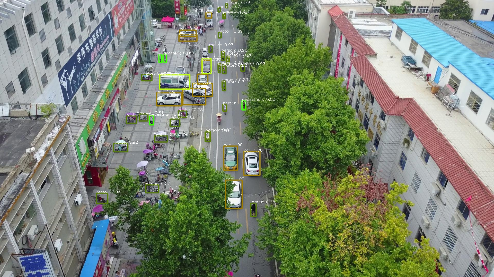
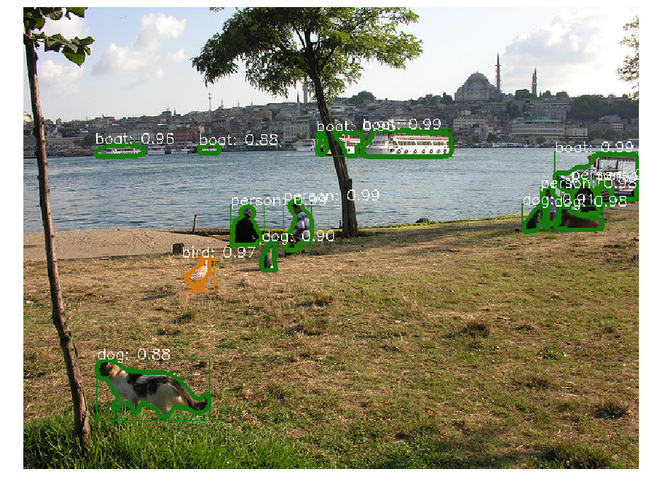

# Object detection in drone-images

##  Prologue

Our project aims to detect various objects in drone-captured images.

We would like to solve this problem as a supervised task, so acquired two datasets containing pictures taken by drones. ('VisDrone' and 'MultiDrone'.)
Both sets come with annotations, what means coordinates for bounding boxes and the ground-truth classes of annotated objects.

Our work is largely based on the following repository:
https://github.com/oulutan/Drone_FasterRCNN

this is in fact a fork of 
https://github.com/facebookresearch/maskrcnn-benchmark

Unfortunately, we had to implement many changes in the orignal code and it has become the easiest way to do so to upload the code instead of forking. (We have found the appropriate arrangement in a Docker-container and from that position, this was the easiest way to upload code.)

Nevertheless, we are grateful for the creators and maintainers of both repositories.

## How to use the codebase?

In this section we introduce the basic functionality of the codebase. The nub of our project in a nutshell: we build our model on top of the second repository. This is beneficial, because the second author has released the weigths of a model of his, trained on the VisDrone dataset. 

### Installation

We think that using Docker containers is the only sensible solution.
Because of the transfer-learning and our 'custom' dataset, matters are even more complicated, there are caveats that need extra attention.

1. get the [docker/Dockerfile](Dockerfile), download it to your local device
2. get the weigths for the model: https://drive.google.com/file/d/1SCJf2JJmyCbxpDuy4njFaDw7xPqurpaQ/view?usp=sharing into the _same_ directory which contains the Dockerfile (during building the Dockerimage, the daemon will look for it in that context!)
3. get the link for the custom dataset annotations: as we work on custom data, we implemented the fetching of appropriate images in the Dockerfile. _However_, due to lincense issues, we must not publicly release the annotations. To circumvent this, the following scheme is implemented
    + first, PM me (kptzeg@gmail.com) to request access to the annotations
    + I will send the link to a private GithubGist, which contains the annot files
    + __what you have to do__: edit the Dockerfile such that you paste this link into the appropriate place before building, so the annotations will be cloned into the container
4. after the new Dockerfile and the weigths (~800 MB) are assembled in your directory, build the image with eg.: (from the parentdir) __sudo nvidia-docker build -t zold137 docker/__
5. building is likely to take ~ 1 hour. After that, you have the image, which is roughly 12 GB
    + during the building, a sample dataset from the custom data is downloaded too
    
### Fetching more data

Loading our custom data is implemented in [datasets/data_gen.py](datasets/data_gen.py). For the installation procedure, only one video ('giro1') is processed.
Before a serious training, you should obviously download the whole data.

+ to do so, you need to modify the code a bit: comment out __break__
+ you may consider modifying the train-test split ratio too
+ however, due to the dataset management of the current implementation, you won't be able to merge the data of the videos, this may be a TODO point, but since we are talking about fine-tuning, this may not be so much necessary


TODO: add the VisDrone dataset too 
+ this requires a bit more work (implementing appropriate dataset class and rewriting configs - _guys (Ádám, Soma): you may want to ask for help before starting!_

### Sample training

If you have set up the Docker container correctly, you can have a look at a sample training without downloading more data (as described above).

1. go to [drone_demo](drone_demo)
2. here you find the training script,[drone_demo/train_net.py] ,that is a modified version of the original, provided by the second predecessor 
3. this script uses the following resources: 
    + the weighs, that will be copied to this directory by the daemon under the name of __visdrone_model_0360000.pth__
    + a config file that is eaten by the model-building-machinery of the code. This contains all relevant information about the model. Eg. here is defined, from where the model gets the data to train and test on, what weigths in the backbone are frozen, etc. (Basically everything.) We will use [drone_demo/d_e2e_faster_rcnn_X_101_32x8d_FPN_1x_visdrone.yaml](drone_demo/d_e2e_faster_rcnn_X_101_32x8d_FPN_1x_visdrone.yaml). Due to scarcity of GPU resources on my local device, this config has really small batch sizes, number of workers, etc. _So on your device, you may want to modify these settings. Hints are given in the original maskrcnn-benchmark readme._
4. run __python train_net.py --config-file d_e2e_faster_rcnn_X_101_32x8d_FPN_1x_visdrone.yaml__. If you have set up everything correctly, this will run a mini-training and testing session (for illustrative purposes)
    + before this, you may want to reduce the no. of test images, because testing is very slow with the default settings (on my device at least)
    + to ensure smooth running two points have been solved in a very cheap manner (due to the almost-fatal time shortage)
        ++ the evaluation of the testing - which is processing predictions etc. - is done with separate evaluation scripts. _Now, there is no such script for our custom dataset_ What is done is to notify the user on STDOUT that we reached the evaluation stage (TODO)
        ++ because of throwing errors, the approporiate dataset object and respective methods and funcions are 'commented out'. I suspect that this is due to upgrades in the __cocoapi__ repostiory. Errors started popping when I built the API with the new, non-deprecated way (makefile instead of setup.py). This may be fixed, but not so important, because we won't tratin on COCO data.
        
This is the basics.


### The model

Thus, we mean to do _transfer-learning on that model_, because we only have access to limited GPU resorces.

The model comes from the _Faster-RCNN_ family, a widely known architecture. It consits of three main parts:
1. convolutional backbone - for feature extraction
2. RPN - Region Proposal Network for the domains of interest on the picture
3. ROI head - this last stage is generally responsible for the bounding-box regression and the classification

In our (our predecessors') code, the model is generated from a config file with the machinery of the _maskrcnn-benchmark_ repository. The model weigths for the particular model we want to make transfer-learn are loaded. Details previously mentioned.


## zold137/datasets

This directory contains our code and documentation for data acquisition and basic processing.

__BEHOLD: due to lincensing issues, we must not publish the annotations. They are avalable from a secret gist upon reasonable request__

__description_of_datasets__ is our writeup about the data with a self-explaining name.

In addition to this, we provide basic visualization in Jupyter Notebooks 'Saving_frames_and_drawing_boxes.ipynb' and 'Data_inspection.ipynb' for datasets MultiDrone and VisDrone respectively.

The main purpose of these notebooks is to introduce the datasets and give some impression about them. As both sets consist of numerous pictures, they are not uploadaded to GitHub. 

Thus, one may not want to run the code, only look at the visualized examples.

## zold137/conv_tests

This directory is __not__ part of the 1<sup>st</sup> milestone. We started to experiment with renowned CNNs if they correctly classify objects cropped from the ground-truth bounding boxes. 

May contain sharp edges, it is not recommended to look at it now.

---------------------- Original VisDrone Readme -------------------

This is a fork of maskrcnn-benchmark repository that is focused on detecting objects from drone view images. The model checkpoint is trained on the VisDrone dataset. 



A sample output video
https://drive.google.com/file/d/1CGDoWD9XWHL56O-sh15lLUVXx6StKggm/view

VisDrone Dataset:
http://aiskyeye.com/

Original Repo:
https://github.com/facebookresearch/maskrcnn-benchmark


# Installation

1. pip install torch==1.1.0 torchvision==0.3.0 -f https://download.pytorch.org/whl/torch_stable.html
2. pip install ninja yacs cython matplotlib tqdm opencv-contrib-python
3. Follow these scripts. We will download cocoapi here as well

```bash
## in ./Drone_FasterRCNN
# install pycocotools
git clone https://github.com/cocodataset/cocoapi.git
cd cocoapi/PythonAPI
python setup.py build_ext install

cd ../..
## back in ./Drone_FasterRCNN
# install PyTorch Detection

# the following will install the lib with
# symbolic links, so that you can modify
# the files if you want and won't need to
# re-build it
python setup.py build develop


```
# Test installation

```bash
cd demo
wget https://download.pytorch.org/models/maskrcnn/e2e_faster_rcnn_X_101_32x8d_FPN_1x.pth
python demo.py
```

# Drone View Detection Code

Download the model weights that are trained on VisDrone dataset from https://drive.google.com/file/d/1SCJf2JJmyCbxpDuy4njFaDw7xPqurpaQ/view?usp=sharing into ./drone_demo directory. 

```bash
cd drone_demo
python demo.py
```


---------------------- Original Readme -------------------
# Faster R-CNN and Mask R-CNN in PyTorch 1.0

This project aims at providing the necessary building blocks for easily
creating detection and segmentation models using PyTorch 1.0.



## Highlights
- **PyTorch 1.0:** RPN, Faster R-CNN and Mask R-CNN implementations that matches or exceeds Detectron accuracies
- **Very fast**: up to **2x** faster than [Detectron](https://github.com/facebookresearch/Detectron) and **30%** faster than [mmdetection](https://github.com/open-mmlab/mmdetection) during training. See [MODEL_ZOO.md](MODEL_ZOO.md) for more details.
- **Memory efficient:** uses roughly 500MB less GPU memory than mmdetection during training
- **Multi-GPU training and inference**
- **Batched inference:** can perform inference using multiple images per batch per GPU
- **CPU support for inference:** runs on CPU in inference time. See our [webcam demo](demo) for an example
- Provides pre-trained models for almost all reference Mask R-CNN and Faster R-CNN configurations with 1x schedule.

## Webcam and Jupyter notebook demo

We provide a simple webcam demo that illustrates how you can use `maskrcnn_benchmark` for inference:
```bash
cd demo
# by default, it runs on the GPU
# for best results, use min-image-size 800
python webcam.py --min-image-size 800
# can also run it on the CPU
python webcam.py --min-image-size 300 MODEL.DEVICE cpu
# or change the model that you want to use
python webcam.py --config-file ../configs/caffe2/e2e_mask_rcnn_R_101_FPN_1x_caffe2.yaml --min-image-size 300 MODEL.DEVICE cpu
# in order to see the probability heatmaps, pass --show-mask-heatmaps
python webcam.py --min-image-size 300 --show-mask-heatmaps MODEL.DEVICE cpu
# for the keypoint demo
python webcam.py --config-file ../configs/caffe2/e2e_keypoint_rcnn_R_50_FPN_1x_caffe2.yaml --min-image-size 300 MODEL.DEVICE cpu
```

A notebook with the demo can be found in [demo/Mask_R-CNN_demo.ipynb](demo/Mask_R-CNN_demo.ipynb).

## Installation

Check [INSTALL.md](INSTALL.md) for installation instructions.


## Model Zoo and Baselines

Pre-trained models, baselines and comparison with Detectron and mmdetection
can be found in [MODEL_ZOO.md](MODEL_ZOO.md)

## Inference in a few lines
We provide a helper class to simplify writing inference pipelines using pre-trained models.
Here is how we would do it. Run this from the `demo` folder:
```python
from maskrcnn_benchmark.config import cfg
from predictor import COCODemo

config_file = "../configs/caffe2/e2e_mask_rcnn_R_50_FPN_1x_caffe2.yaml"

# update the config options with the config file
cfg.merge_from_file(config_file)
# manual override some options
cfg.merge_from_list(["MODEL.DEVICE", "cpu"])

coco_demo = COCODemo(
    cfg,
    min_image_size=800,
    confidence_threshold=0.7,
)
# load image and then run prediction
image = ...
predictions = coco_demo.run_on_opencv_image(image)
```

## Perform training on COCO dataset

For the following examples to work, you need to first install `maskrcnn_benchmark`.

You will also need to download the COCO dataset.
We recommend to symlink the path to the coco dataset to `datasets/` as follows

We use `minival` and `valminusminival` sets from [Detectron](https://github.com/facebookresearch/Detectron/blob/master/detectron/datasets/data/README.md#coco-minival-annotations)

```bash
# symlink the coco dataset
cd ~/github/maskrcnn-benchmark
mkdir -p datasets/coco
ln -s /path_to_coco_dataset/annotations datasets/coco/annotations
ln -s /path_to_coco_dataset/train2014 datasets/coco/train2014
ln -s /path_to_coco_dataset/test2014 datasets/coco/test2014
ln -s /path_to_coco_dataset/val2014 datasets/coco/val2014
# or use COCO 2017 version
ln -s /path_to_coco_dataset/annotations datasets/coco/annotations
ln -s /path_to_coco_dataset/train2017 datasets/coco/train2017
ln -s /path_to_coco_dataset/test2017 datasets/coco/test2017
ln -s /path_to_coco_dataset/val2017 datasets/coco/val2017

# for pascal voc dataset:
ln -s /path_to_VOCdevkit_dir datasets/voc
```

P.S. `COCO_2017_train` = `COCO_2014_train` + `valminusminival` , `COCO_2017_val` = `minival`
      

You can also configure your own paths to the datasets.
For that, all you need to do is to modify `maskrcnn_benchmark/config/paths_catalog.py` to
point to the location where your dataset is stored.
You can also create a new `paths_catalog.py` file which implements the same two classes,
and pass it as a config argument `PATHS_CATALOG` during training.

### Single GPU training

Most of the configuration files that we provide assume that we are running on 8 GPUs.
In order to be able to run it on fewer GPUs, there are a few possibilities:

**1. Run the following without modifications**

```bash
python /path_to_maskrcnn_benchmark/tools/train_net.py --config-file "/path/to/config/file.yaml"
```
This should work out of the box and is very similar to what we should do for multi-GPU training.
But the drawback is that it will use much more GPU memory. The reason is that we set in the
configuration files a global batch size that is divided over the number of GPUs. So if we only
have a single GPU, this means that the batch size for that GPU will be 8x larger, which might lead
to out-of-memory errors.

If you have a lot of memory available, this is the easiest solution.

**2. Modify the cfg parameters**

If you experience out-of-memory errors, you can reduce the global batch size. But this means that
you'll also need to change the learning rate, the number of iterations and the learning rate schedule.

Here is an example for Mask R-CNN R-50 FPN with the 1x schedule:
```bash
python tools/train_net.py --config-file "configs/e2e_mask_rcnn_R_50_FPN_1x.yaml" SOLVER.IMS_PER_BATCH 2 SOLVER.BASE_LR 0.0025 SOLVER.MAX_ITER 720000 SOLVER.STEPS "(480000, 640000)" TEST.IMS_PER_BATCH 1
```
This follows the [scheduling rules from Detectron.](https://github.com/facebookresearch/Detectron/blob/master/configs/getting_started/tutorial_1gpu_e2e_faster_rcnn_R-50-FPN.yaml#L14-L30)
Note that we have multiplied the number of iterations by 8x (as well as the learning rate schedules),
and we have divided the learning rate by 8x.

We also changed the batch size during testing, but that is generally not necessary because testing
requires much less memory than training.


### Multi-GPU training
We use internally `torch.distributed.launch` in order to launch
multi-gpu training. This utility function from PyTorch spawns as many
Python processes as the number of GPUs we want to use, and each Python
process will only use a single GPU.

```bash
export NGPUS=8
python -m torch.distributed.launch --nproc_per_node=$NGPUS /path_to_maskrcnn_benchmark/tools/train_net.py --config-file "path/to/config/file.yaml"
```

## Abstractions
For more information on some of the main abstractions in our implementation, see [ABSTRACTIONS.md](ABSTRACTIONS.md).

## Adding your own dataset

This implementation adds support for COCO-style datasets.
But adding support for training on a new dataset can be done as follows:
```python
from maskrcnn_benchmark.structures.bounding_box import BoxList

class MyDataset(object):
    def __init__(self, ...):
        # as you would do normally

    def __getitem__(self, idx):
        # load the image as a PIL Image
        image = ...

        # load the bounding boxes as a list of list of boxes
        # in this case, for illustrative purposes, we use
        # x1, y1, x2, y2 order.
        boxes = [[0, 0, 10, 10], [10, 20, 50, 50]]
        # and labels
        labels = torch.tensor([10, 20])

        # create a BoxList from the boxes
        boxlist = BoxList(boxes, image.size, mode="xyxy")
        # add the labels to the boxlist
        boxlist.add_field("labels", labels)

        if self.transforms:
            image, boxlist = self.transforms(image, boxlist)

        # return the image, the boxlist and the idx in your dataset
        return image, boxlist, idx

    def get_img_info(self, idx):
        # get img_height and img_width. This is used if
        # we want to split the batches according to the aspect ratio
        # of the image, as it can be more efficient than loading the
        # image from disk
        return {"height": img_height, "width": img_width}
```
That's it. You can also add extra fields to the boxlist, such as segmentation masks
(using `structures.segmentation_mask.SegmentationMask`), or even your own instance type.

For a full example of how the `COCODataset` is implemented, check [`maskrcnn_benchmark/data/datasets/coco.py`](maskrcnn_benchmark/data/datasets/coco.py).

Once you have created your dataset, it needs to be added in a couple of places:
- [`maskrcnn_benchmark/data/datasets/__init__.py`](maskrcnn_benchmark/data/datasets/__init__.py): add it to `__all__`
- [`maskrcnn_benchmark/config/paths_catalog.py`](maskrcnn_benchmark/config/paths_catalog.py): `DatasetCatalog.DATASETS` and corresponding `if` clause in `DatasetCatalog.get()`

### Testing
While the aforementioned example should work for training, we leverage the
cocoApi for computing the accuracies during testing. Thus, test datasets
should currently follow the cocoApi for now.

To enable your dataset for testing, add a corresponding if statement in [`maskrcnn_benchmark/data/datasets/evaluation/__init__.py`](maskrcnn_benchmark/data/datasets/evaluation/__init__.py):
```python
if isinstance(dataset, datasets.MyDataset):
        return coco_evaluation(**args)
```

## Finetuning from Detectron weights on custom datasets
Create a script `tools/trim_detectron_model.py` like [here](https://gist.github.com/wangg12/aea194aa6ab6a4de088f14ee193fd968).
You can decide which keys to be removed and which keys to be kept by modifying the script.

Then you can simply point the converted model path in the config file by changing `MODEL.WEIGHT`.

For further information, please refer to [#15](https://github.com/facebookresearch/maskrcnn-benchmark/issues/15).

## Troubleshooting
If you have issues running or compiling this code, we have compiled a list of common issues in
[TROUBLESHOOTING.md](TROUBLESHOOTING.md). If your issue is not present there, please feel
free to open a new issue.

## Citations
Please consider citing this project in your publications if it helps your research. The following is a BibTeX reference. The BibTeX entry requires the `url` LaTeX package.
```
@misc{massa2018mrcnn,
author = {Massa, Francisco and Girshick, Ross},
title = {{maskrcnn-benchmark: Fast, modular reference implementation of Instance Segmentation and Object Detection algorithms in PyTorch}},
year = {2018},
howpublished = {\url{https://github.com/facebookresearch/maskrcnn-benchmark}},
note = {Accessed: [Insert date here]}
}
```

## Projects using maskrcnn-benchmark

- [RetinaMask: Learning to predict masks improves state-of-the-art single-shot detection for free](https://arxiv.org/abs/1901.03353). 
  Cheng-Yang Fu, Mykhailo Shvets, and Alexander C. Berg.
  Tech report, arXiv,1901.03353.
- [FCOS: Fully Convolutional One-Stage Object Detection](https://arxiv.org/abs/1904.01355).
  Zhi Tian, Chunhua Shen, Hao Chen and Tong He.
  Tech report, arXiv,1904.01355. [[code](https://github.com/tianzhi0549/FCOS)]

## License

maskrcnn-benchmark is released under the MIT license. See [LICENSE](LICENSE) for additional details.
